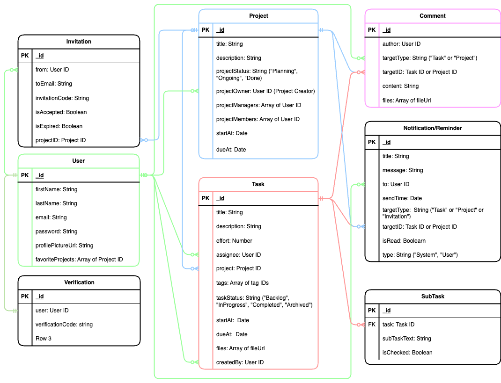

# Taskify APIs

## General Information

Taskify API

```
https://task-manager-be-zi2w.onrender.com/api
```

## API Reference

### Authentication API

```javascript
/**
 * @route POST /auth/login
 * @description Login with email and password
 * @body { email, password }
 * @access Public
 */
```

### Verification API

```javascript
/**
 * @route PUT /verifications/:verificationCode
 * @description verifying a user through verification Code
 * @access Public
 */
```

### User APIs

```javascript
/**
 * @route POST /users
 * @description Register new account
 * @body { firstName, lastName, email, password }
 * @access Public
 */
```

```javascript
/**
 * @route GET /users
 * @description Get users with pagination
 * @access login required
 */
```

```javascript
/**
 * @route GET /users/:id
 * @description Get a single user info
 * @access login required
 */
```

```javascript
/**
 * @route GET /users/me
 * @description Get the current user info
 * @access login required
 */
```

```javascript
/**
 * @route PUT /users/:id
 * @description Update user profile
 * @body {firstName, lastName, profilePictureUrl}
 * @access login required
 */
```

```javascript
/**
 * @route DELETE /users/:id
 * @description Delete a user profile
 * @access login required
 */
```

```javascript
/**
 * @route POST /users/:id/favorite/projects
 * @description Add a project to user's favorite list
 * @body {projectId }
 * @@access login required
 */
```

```javascript
/**
 * @route GET /users/:id/favorite/projects
 * @description get a list of favorite projects of a user
 * @query { search, projectStatus: "Planning" or "Ongoing" or "Done', currentUserRole: "Owner" or "Lead" or "Member", startAfter, startBefore, dueAfter, dueBefore}
 * @access login required
 */
```

```javascript
/**
 * @route DELETE /users/:id/favorite/projects/:projectId
 * @description remove project from User's favorite list
 * @access login required
 */
```

### Project APIs

```javascript
/**
 * @route POST /projects
 * @description Create a project
 * @body {title, description, projectStatus, startAt, dueAt, projectMembers}
 * @access login required
 */
```

```javascript
/**
 * @route GET /projects
 * @description Get a list of projects
 * @query { search, projectStatus: "Planning" or "Ongoing" or "Done", currentUserRole: "Owner" or "Lead" or "Member", startAfter, startBefore, dueAfter, dueBefore, sortBy: "title_asc" or "title_desc" or "created_at_asc" or "created_at_desc"}
 * @access login required
 */
```

```javascript
/**
 * @route GET /projects/:projectId
 * @description get detail of a project
 * @access login required
 */
```

```javascript
/**
 * @route GET /projects/:projectId/projectMembers
 * @description Get list of project members of a project
 * @query {search}
 * @access login required
 */
```

```javascript
/**
 * @route PUT /projects/:projectId
 * @description Update project
 * @body { title, description, projectStatus: "Planning" or "Ongoing" or "Done", startAt, dueAt}
 * @access login required - project owner
 */
```

```javascript
/**
 * @route DELETE /projects/:projectId
 * @description delete a project
 * @access login required - project owner
 */
```

```javascript
/**
 * @route GET /projects/:projectId/newMembers
 * @description get a list of new users to be added to the project and their invitation status
 * @access login required
 */
```

```javascript
/**
 * @route POST /projects/:projectId/invitations
 * @description send an invitation to a project member
 * @body { to }
 * @access login required
 */
```

```javascript
/**
 * @route GET /projects/:projectId/invitations
 * @description Get a list of my project invitations with pagination
 * @query {search, status: "pending" or "accepted" or "declined" or "canceled"}
 * @access login required
 */
```

```javascript
/**
 * @route DELETE /projects/:projectId/invitations/:inviteeId
 * @description Cancel an invitation
 * @access login required
 */
```

```javascript
/**
 * @route PUT /projects/:projectId/invitations/:inviteeId
 * @description React to an invitation
 * @body { status: "accepted" or "declined" }
 * @access login required
 */
```

```javascript
/**
 * @route PUT /projects/:projectId/projectMembers/:memberId
 * @description change role of a project member
 * @body { isNewLead: true or false }
 * @access login required
 */
```

```javascript
/**
 * @route DELETE /projects/:projectId/projectMembers/:memberId
 * @description remove a member from project
 * @access login required
 */
```

### Invitation APIs

```javascript
/**
 * @route GET /invitations/incoming
 * @description get a list of current user's incoming invitations with pagination
 * @access login required
 */
```

### Task APIs

```javascript
/**
 * @route POST /tasks
 * @description create a task
 * @body {title, description, taskStatus: "Backlog" or "InProgress" or "Completed" or "Archived", assigneeId, projectId, startAt, dueAt}
 * @access login required - project owner, project Lead for projects. Any user can create task for personal tasks.
 */
```

```javascript
/**
 * @route GET /tasks
 * @description get a list of current user's tasks with pagination
 * @query {search, taskStatus: "Backlog" or "InProgress" or "Completed" or "Archived",  assigneeId, projectId, startBefore, startAfter, dueBefore, dueAfter}
 * @access login required
 */
```

```javascript
/**
 * @route GET /tasks/:taskId
 * @description get detail of a task
 * @access login required
 */
```

```javascript
/**
 * @route PUT /tasks/:taskId
 * @description edit fields of tasks
 * @body { title, description, assigneeId, projectId, taskStatus: "Backlog" or "InProgress" or "Completed" or "Archived", startAt, dueAt, files }
 * @access login required - project owner, project Lead for projects, normal project member can only update taskStatus. Any user can edit personal tasks.
 */
```

```javascript
/**
 * @route DELETE /tasks/:taskId
 * @description delete a task
 * @access login required - same as edit task
 */
```

```javascript
/**
 * @route GET /tasks/:taskId/comments
 * @description get a list of comments in a task with pagination
 * @access login required
 */
```

### Comment APIs

```javascript
/**
 * @route POST /comments
 * @description Create a comment
 * @body { targetType: "Task" or "Project", targetId, content, files } // files only allow if targetType is Task
 * @access login required
 */
```

```javascript
/**
 * @route PUT /comments/:commentId
 * @description Edit comment content
 * @body { content, files }
 * @access login required
 */
```

```javascript
/**
 * @route DELETE /comments/:commentId
 * @description Delete a comment
 * @access login required
 */
```

```javascript
/**
 * @route GET /comments/:id
 * @description Get detail of a comment
 * @access login required
 */
```

### Notification and Reminder APIs

```javascript
/**
 * @route GET /notifications
 * @description get list of notifications to current User with pagination
 * @query {isRead: true or false, type: "System" or "User", targetType: "Project" or "Task" or "Invitation"}
 * @access login required
 */
```

```javascript
/**
 * @route PUT /notifications/:notificationId
 * @description change notification details
 * @body {isRead: true or false}
 * @access login required
 */
```

```javascript
/**
 * @route PUT /notifications
 * @description update all notifications and return filtered notifications
 * @body {isRead: true and false, page, limit}
 * @access login required
 */
```

```javascript
/**
 * @route DELETE /notifications/:notificationId
 * @description delete notification
 * @access login required
 */
```

```javascript
/**
 * @route DELETE /notifications
 * @description delete many notifications by filter
 * @query {isRead: true or false}
 * @access login required
 */
```

## Entity Relationship Diagram (ERD)


